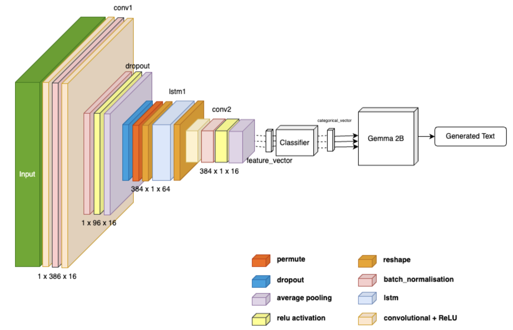

### **Neurocognitive Modeling for Text Generation: Deep Learning Architecture for EEG Data**  




**Author:** Khushiyant  
**Repository:** [GitHub Pages Link](https://khushiyant.github.io/neurocognitive-modeling)  

---

## **Abstract**  
Text-generating capabilities have undergone a substantial transformation with the introduction of large language models (LLMs). However, Electroencephalography (EEG)-based text production remains a challenge due to high data and computational requirements. This paper presents a novel approach combining the **Gemma 2B LLM** with a **classifier-LLM architecture** and an **RNN encoder**, significantly reducing data and compute demands while achieving performance improvements of **10%** over existing methods.  

Our approach demonstrates efficient **transfer learning** for EEG-based text production, offering a **robust and functional** system even under data constraints. The integration of **EEG decoding with LLMs** has the potential to advance assistive technologies, enabling greater independence and communication for individuals with severe motor limitations.  

---

## **Key Contributions**  
**Novel Architecture:** RNN encoder + classifier-LLM pipeline  
**Performance Improvement:** 10% over baseline EEG-based text generation  
**Efficient Transfer Learning:** Reduces dataset and compute requirements  
**Applications:** Enhancing Brain-Computer Interfaces (BCIs) for assistive communication  

---

## **Paper Structure**  
**Introduction** – Overview of EEG-based text generation challenges  
**Related Work** – Existing methods and limitations  
**Proposed Framework** – Architecture of RNN encoder and classifier-LLM integration  
**Experiments & Results** – Performance benchmarking and comparison  
**Conclusion & Future Work** – Impact on BCI applications and next steps  

---

## **Citation**  
If you find this work useful, please consider citing:  
```
@article{khushiyant2024neurocognitive,
  title={Neurocognitive Modeling for Text Generation: Deep Learning Architecture for EEG Data},
  author={Khushiyant},
  year={2024},
  journal={Unpublished Manuscript}
}
```

---

## **Contact & Contributions**  
For inquiries, feedback, or collaboration, feel free to open an **issue** or reach out via khushiyant2002@gmail.com.  